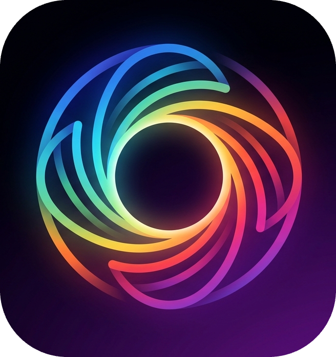
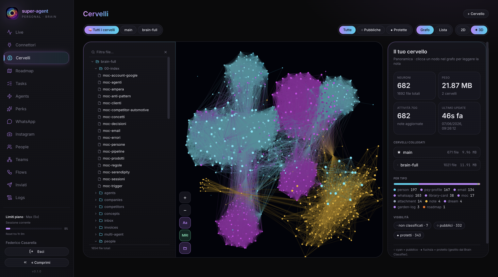

<p align="center">
  
</p>

<h1 align="center">super-agent</h1>

<p align="center">
  <em>A personal AI agent that lives in your Telegram, thinks with Claude Code, and grows a second brain that maintains itself.</em>
</p>

<p align="center">
  
</p>


Chat with it on Telegram. It reasons with the Claude Code CLI, keeps a growing Obsidian-style knowledge vault, and acts through pluggable connectors — reading your email, transcribing voice notes, running your WhatsApp and Instagram DMs, spawning parallel sub-agents — always asking before it does anything irreversible.

### Why it's different

Two products already own half of this idea. **Obsidian** gives you a knowledge vault and a graph — but it doesn't *think*. **OpenClaw** gives you an autonomous agent across channels — but it doesn't *remember* in a navigable brain. super-agent is the only one that fuses both, then adds a third axis nobody else has: **agents that connect to each other.**

| | Knowledge brain (vault + graph) | Autonomous agent | Connectors / messaging | Agent-to-agent network |
|---|:---:|:---:|:---:|:---:|
| **Obsidian** | ✅ static, no agent | ❌ | ❌ plugins only | ❌ |
| **OpenClaw** | ❌ | ✅ | ✅ 10+ channels | ❌ |
| **super-agent** | ✅ vault + 3D graph | ✅ | ✅ imap · whatsapp · instagram · voice · telegram | ✅ agents talk to agents |

---

## What it does

- **🧠 Second brain** — every conversation, call, and document is distilled into a markdown vault (Obsidian-style), indexed in Postgres and explorable as a live 3D knowledge graph in the web UI.
- **💬 Telegram-native** — the agent lives in your chat. Talk to it like a person; it replies, reacts, sends stickers, and keeps context across turns.
- **🗺️ Roadmap-driven** — it doesn't just answer, it *advances*. A structured roadmap (horizons · strategy · KPIs · activity log) steers each reply toward the highest-leverage next step instead of drifting.
- **🤖 Parallel sub-agents** — hand it several deliverables and it proposes a batch of background agents; you approve with one tap and watch them run live from the `/agents` view.
- **👥 Custom agents & teams** — define your own named agents (role · system prompt · skills · model) and assign multi-step team tasks they execute together.
- **🔀 Flows** — a trigger→action automation engine: wire events to steps without leaving the dashboard.
- **🕸️ Network** — connect your agent to *other people's* agents and let them exchange context across a trusted graph.
- **🎙️ Voice in** — send a voice note, get an accurate transcription via Whisper (Groq / OpenAI / custom endpoint).
- **📧 Email, with a safety net** — reads your inbox over IMAP and *drafts* replies; nothing is ever sent until you tap ✅ on Telegram.
- **📱 WhatsApp & Instagram** — runs your DMs into the brain and surfaces them in the dashboard, same human-in-the-loop guardrail.
- **⏰ Scheduled tasks** — recurring jobs run on cron and report back into the chat.
- **🔌 MCP bridge** — connector tools are exposed to Claude over the Model Context Protocol, so the model can call them natively.

### Human-in-the-loop by default
Every action with real-world consequences — sending an email, spawning agents, replying to a DM — is *proposed*, not executed. You confirm with an inline ✅ / ❌ on Telegram. The agent is autonomous in thought, deliberate in action.

---

## The brain that runs itself

super-agent isn't a chatbot that sits idle until you type. **Seven internal agents run on their own cron schedule** — classifying, connecting, profiling, pruning, ingesting, dreaming, and even *looking at itself in the mirror* — so the second brain keeps growing and stays healthy even when no one is at the keyboard.

| Agent | Cadence | What it does |
|-------|---------|--------------|
| **🏷️ Brain Classifier** | nightly 04:00 | Tags every note as protected or public (frontmatter + index) via path/kind/keyword heuristics. Deterministic — zero LLM cost. |
| **🪢 Link Weaver** | nightly 04:15 | Finds the 1–6 best related notes per note (shared tags, body mentions, folder co-locality, email↔person) and writes them into `related:`. Deterministic — zero LLM cost. |
| **🧬 People Analyzer** | daily 03:00 | Builds a psychological profile — fears, levers, relational style — of each person, from every brain node linked to them. |
| **🌿 Vault Gardener** | daily | Prunes orphan / stale notes (archived, never deleted), waters thin-but-central notes with fresh content, plants MOC seeds for tag clusters. |
| **📚 Vault Librarian** | every 3h | Pulls the best writing in your sector — top GitHub repos + live RSS (HN, TechCrunch, The Verge, MIT Tech Review, Wired) — filters by relevance, dedups by URL, files it into the vault. |
| **🌙 Vault Dreamer** | nightly 04:00 | Samples distant notes and surfaces unexpected connections — a serendipity engine that dreams for you while you sleep. |
| **🪞 Selfie Agent** | nightly | Reads a fresh sample of the vault, then sends a character-locked self-portrait (Flux LoRA) to Telegram — the brain reflecting on itself. |

Each runs on a configurable schedule, reports back into Telegram, and toggles from the `/agents` view. The deterministic agents (classify, link) cost nothing; the creative ones call Claude only when they actually act.

---

## How it works

```
Telegram  ──▶  Orchestrator  ──▶  Claude Code CLI (claude -p, headless)
   ▲                │                       │
   │                ▼                       ▼
   │           Connectors  ◀──MCP──▶   tools (email, voice, wa/ig, tasks, …)
   │                │
   └── approvals    ▼
            Second brain (markdown vault + Postgres index)
                    │
        ┌───────────┼────────────┐
        ▼           ▼            ▼
   3D graph   internal agents   network (agent ↔ agent)
        │      (cron, self-maintaining)
        ▼
   Web dashboard (graph · agents · teams · flows · logs · settings)
```

- **Backend** — Node + TypeScript, Express, WebSocket, Telegraf, Postgres, node-cron. Boots the orchestrator, the scheduler, the Telegram bots, the internal-agent cron, and the connector registry.
- **Reasoning** — the Claude Code CLI in headless mode (`claude -p`, streamed JSON), with per-turn tool tracking.
- **Brain** — an Obsidian-style markdown vault plus a Postgres index for fast retrieval and graph building.
- **Frontend** — Vite + React + TypeScript + Tailwind: dashboard, 3D knowledge graph, connectors, live agents, custom agents & teams, flows, roadmap, people, network, channel inboxes, logs, settings.

---

## Connectors

Built-in (auto-loaded at boot):

| Connector | What it does |
|-----------|--------------|
| `agent`     | Agent self-control — quiet hours, sleep/wake, and the roadmap engine that drives the conversation. |
| `imap`      | Email (IMAP + SMTP, multi-account) — reads mailboxes into the brain and drafts replies with human-in-the-loop approval. |
| `whatsapp`  | Runs your WhatsApp into the brain — contacts, chats, people-linking. |
| `instagram` | Instagram DMs (Playwright) — threads surfaced in the dashboard and brain. |
| `voice`     | Speech-to-text via Whisper (Groq / OpenAI / custom). |
| `people`    | People intelligence — who's who across your conversations, with dedup tooling. |
| `tasks`     | Scheduled, recurring tasks surfaced back into chat. |

Each connector exposes typed tools to the agent through the MCP bridge.

---

## Quick start

```bash
cp .env.example .env
# edit DATABASE_URL
createdb super_agent
npm install
npm run db:migrate
npm run dev
```

Open **http://localhost:5173** → onboarding wizard → connect your Telegram bot and you're talking to your agent.

> **Heads up:** the migration is a standalone step (`npm run db:migrate`) — it does **not** run automatically on boot. Re-run it after pulling schema changes.

---

## Extending it

Drop a folder in `backend/src/connectors/builtin/<name>/` with an `index.ts` that exports the `Connector` interface (`manifest`, optional `tools`, `onTick`, `onMessage`, `test`). It's auto-loaded at the next boot — no registration needed.

```ts
export default {
  manifest: { name: 'my-connector', title: 'My Connector', /* … */ },
  tools: [ /* typed tools exposed to the agent */ ],
  test: async (cfg) => ({ ok: true }), // optional live connectivity check
} satisfies Connector;
```

New internal (cron) agents follow the same pattern: drop a file in `backend/src/agents/internal/` exporting an `InternalAgent` (`name`, `title`, `description`, default schedule, `run`) and register it in `registry.ts`.

---

## Stack

- **Backend:** Node · TypeScript · Express · ws · Telegraf · Postgres · node-cron
- **Frontend:** Vite · React · TypeScript · Tailwind
- **LLM:** Claude Code CLI (`claude -p`, headless)
- **Brain:** Obsidian-style markdown vault + Postgres index
- **Channels:** Telegram · IMAP/SMTP · WhatsApp · Instagram · Voice (Whisper)

---

## Contributing

PRs welcome. The codebase is modular by design — most contributions are a single
new connector or internal agent (see [Extending it](#extending-it)), with no core
changes needed. For anything larger, open an issue first so we can align.

`tsc -p backend/tsconfig.json` should pass clean before you push.

---

## Authors & credits

- **[Federico Casarella](https://github.com/FedericoCasarella)** — creator & maintainer
- **[Mattia Calastri](https://github.com/mattiacalastri)** — co-maintainer & contributor

Developed with **[Claude Code](https://claude.com/claude-code)** (Anthropic) as an
AI pair-programming partner — the same reasoning engine that powers the agent at runtime.
